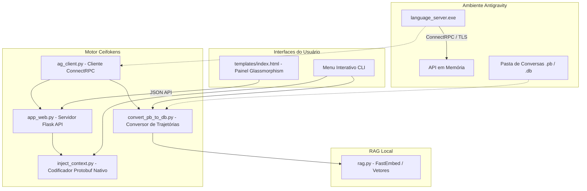

# Arquitetura e Engenharia Reversa do Ceifokens Sanitizador

Este documento descreve detalhadamente a arquitetura de software, o fluxo de dados de ponta a ponta e as descobertas de engenharia reversa que sustentam o ecossistema do **Ceifokens Sanitizador**.

---

## 1. Visão Geral do Sistema

O Ceifokens Sanitizador é uma suíte de ferramentas projetada para extrair, converter, buscar semanticamente e injetar contextos artificiais no histórico de conversas do assistente de IA **Antigravity**. Ele é composto por três frentes que se integram de forma transparente:



---

## 2. Mapa de Componentes (Estrutura de Arquivos)

| Arquivo | Componente / Camada | Responsabilidade Principal |
| :--- | :--- | :--- |
| **`ag_client.py`** | Integração / Rede | Localiza a porta dinâmica e o CSRF token do processo ativo do Antigravity via `psutil`. Estabelece a conexão HTTPS ConnectRPC segura com o servidor do Google. |
| **`app_web.py`** | Servidor Backend | Servidor Flask que centraliza os endpoints REST da aplicação Web. Gerencia o fluxo de conversão "em memória" entre os estados do Antigravity e manipula o banco SQLite para injeções diretas. |
| **`static/style.css`** | Interface (Aesthetics) | Folha de estilo unificada. Implementa o design system escuro (dark mode), elementos semitransparentes (glassmorphism), timelines de mensagens com balões, animações de progresso e toasts responsivos. |
| **`templates/index.html`** | Interface (SPA) | Front-end de página única (Single Page Application). Consome as rotas do Flask em tempo real para exibir status do sistema, listar conversas, orientar a conversão em 2 etapas e injetar novos turnos. |
| **`convert_pb_to_db.py`** | Conversão / Manipulação | Implementa a ponte de extração que migra as trajetórias salvas em formato criptografado `.pb` para arquivos abertos SQLite `.db`, injetando de forma cirúrgica metadados de UUID funcionais. |
| **`inject_context.py`** | Engenharia / Protobuf | Motor de codificação Protobuf binário nativo. Serializa artificialmente mensagens como se fossem turnos reais do Usuário (`userInput`) ou do Agente (`plannerResponse`) sem corromper o banco. |
| **`rag.py`** | Busca / Inteligência | Indexa o histórico de conversas locais usando o modelo de embedding multilíngue `FastEmbed` de forma 100% offline, provendo busca semântica em frações de milisegundo. |
| **`start_painel.bat`** | Utilitário / CLI | Script de um clique para iniciar o servidor web do Flask no Windows. |

---

## 3. Engenharia Reversa de Baixo Nível

O motor do Ceifokens Sanitizador baseia-se em duas grandes descobertas de engenharia reversa da API proprietária do Antigravity:

### A. Alinhamento de UUIDs no Blob Protobuf (`trajectory_metadata_blob`)
Quando o Antigravity carrega uma conversa no formato SQLite (`.db`), seu executor executa um teste de consistência muito rígido para verificar se o banco de dados pertence ao workspace ativo do usuário. Ele exige que o UUID da conversa (`cascade_id`) e o UUID da execução (`trajectory_id`) presentes na tabela estrutural **`trajectory_meta`** sejam exatamente iguais aos UUIDs codificados em formato Protobuf salvos como um blob binário na tabela **`trajectory_metadata_blob`** (registro com ID `'main'`).

Se houver uma divergência sequer, o motor retorna o erro fatal:
`[unknown] cascade ID mismatch, executor: , input: <id>`

**A Solução de Bytes do Ceifokens**:
Visto que UUIDs em formato ASCII possuem sempre tamanho fixo de **36 caracteres**, e o Protobuf salva strings sequencialmente precedidas por varints de tamanho, conseguimos substituir os UUIDs sem quebrar a integridade do restante do arquivo Protobuf. 
O script pega um blob binário padrão perfeitamente estruturado e realiza uma substituição direta de bytes em memória (`TEMPLATE_BLOB.replace(OLD_UUID_BYTES, NEW_UUID_BYTES)`) antes de salvá-lo na tabela. Isso burla de forma elegante as travas do motor do Antigravity.

### B. Serialização de `CortexStep` para Injeção de Contexto
A tabela `steps` no banco de dados SQLite armazena o histórico de mensagens. Ela é composta pelas seguintes colunas críticas:
- `step_id` (ASCII, UUID do step)
- `step_type` (Inteiro correspondente ao tipo de step: `14` para Usuário, `15` para Agente)
- `step_metadata` (Blob binário contendo a serialização Protobuf do cabeçalho do step)
- `step_data` (Blob binário contendo o conteúdo da mensagem codificado em Protobuf)

Para que o Antigravity reconheça mensagens injetadas de forma artificial sem travar ou acusar corrupção de banco, o Ceifokens implementa um **serializador Protobuf binário nativo** escrito em Python puro.

- **Codificação de Strings em Protobuf**:
  Uma string no Protobuf é representada pelo formato `[WireType/Tag] [Varint de Tamanho] [Bytes UTF-8]`.
  - A tag de dados textuais para o input do usuário na especificação interna é `1`. A tag binária final correspondente ao tipo `Length-delimited` para esse campo é `0x0a` (`1 << 3 | 2`).
  - O tamanho da string é convertido em uma representação Varint de base 128 antes de anexar o texto codificado em UTF-8.

- **Codificação de Varints (Base 128)**:
  Para serializar os tamanhos dos textos e cabeçalhos, o script divide o inteiro em grupos de 7 bits, definindo o bit mais significativo (MSB) como `1` em todos os bytes, exceto no último byte da sequência.

Isso nos permite montar os buffers binários de forma cirúrgica na memória (`inject_context.py`) e inseri-los direto em lote via SQL `INSERT INTO steps` sem depender de nenhum compilador do Google Protocol Buffers.

---

## 4. O Fluxo de Conversão Assistida (.pb para .db)

Para burlar a criptografia de arquivos `.pb` sem precisar quebrar a chave do algoritmo AES-GCM (que é gerenciada por chaves ofuscadas dentro do módulo nativo do Google), o Ceifokens desenvolveu o fluxo de **conversão em dois passos**:

```
[Antigravity Ativo] 
        │ 
        ├─► Passo 1: O Flask consome a API ConnectRPC em memória ativa do language_server.exe
        ├─► Toda a transcrição descriptografada é mantida temporariamente em memória no Flask
        │ 
[Usuário fecha o Antigravity] 
        │ 
        ├─► Passo 2: O Flask detecta automaticamente que o processo language_server.exe encerrou
        ├─► O banco SQLite (.db) é criado fisicamente no disco
        ├─► O arquivo original (.pb) é movido para backup (.pb.bak)
        ├─► Os dados decifrados e o patch binário de UUIDs são gravados no novo .db
        │ 
[Usuário reabre o Antigravity] 
        │ 
        └─► O Antigravity lê o arquivo .db em texto aberto transparentemente
```

---

## 5. Manutenção e Solução de Problemas

Se o Antigravity atualizar e as integrações pararem de funcionar, verifique os seguintes pontos nesta ordem:

1. **Mudança do Nome do Processo**:
   O `ag_client.py` busca pelo processo `language_server.exe` ou `language_server` (no Linux/WSL). Verifique se o Google alterou o nome do executável da API local.
2. **Mudança nas Tags de Linha de Comando**:
   O script extrai o token CSRF de `--csrf_token <token>` e a porta de `--https_server_port <porta>`. Verifique se esses parâmetros ainda existem ao listar a linha de comando do processo.
3. **Mudança no Formato do SQLite**:
   Se o banco de dados SQLite passar a exigir novas colunas na tabela `steps` ou `trajectory_meta`, o console retornará erros de escrita do SQL. Use uma ferramenta visual de SQLite para comparar o esquema de um banco de dados original recém-criado com as tabelas instanciadas em `convert_pb_to_db.py`.
